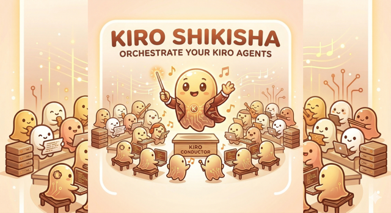
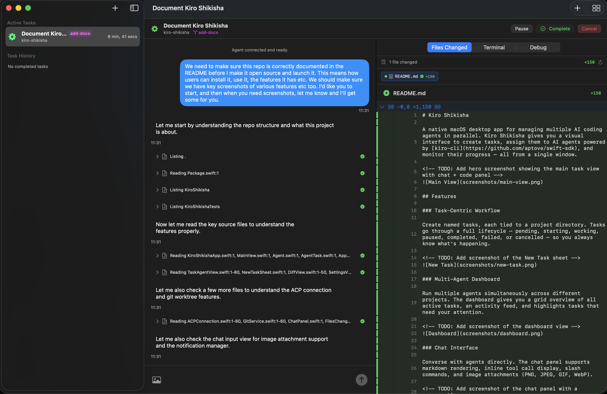
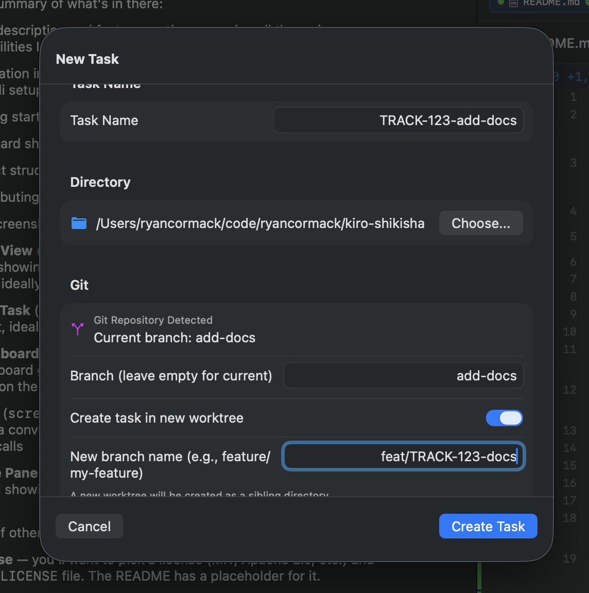
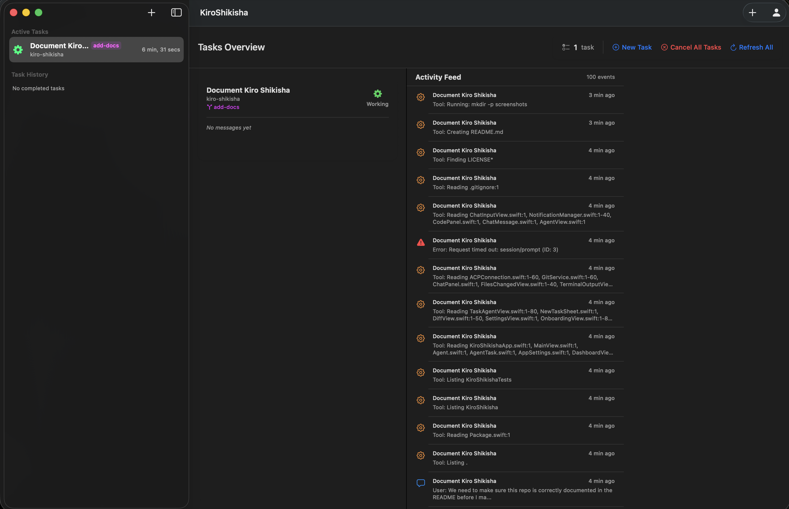
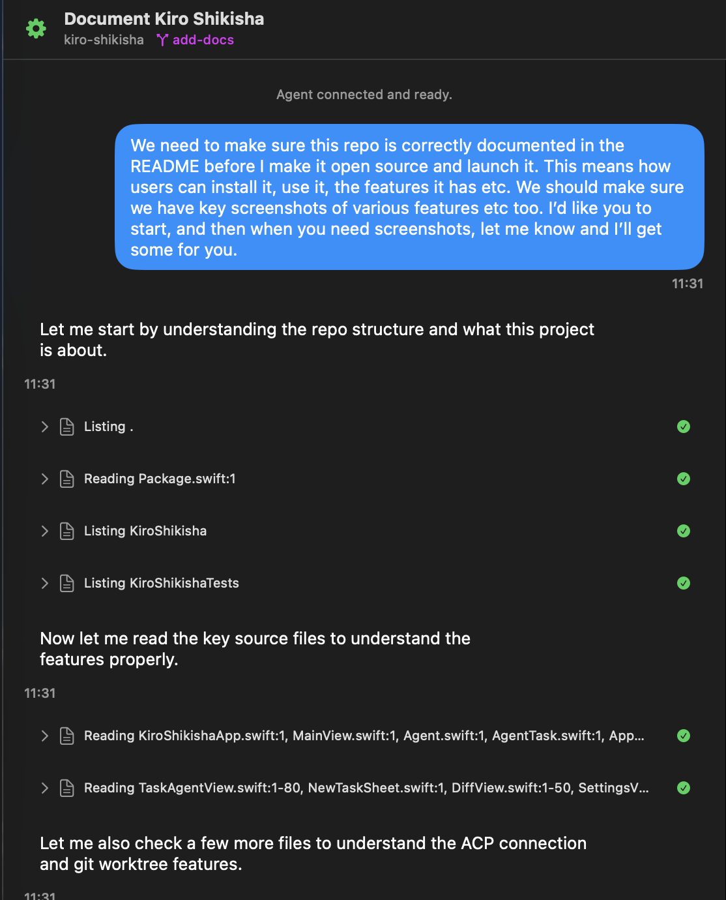
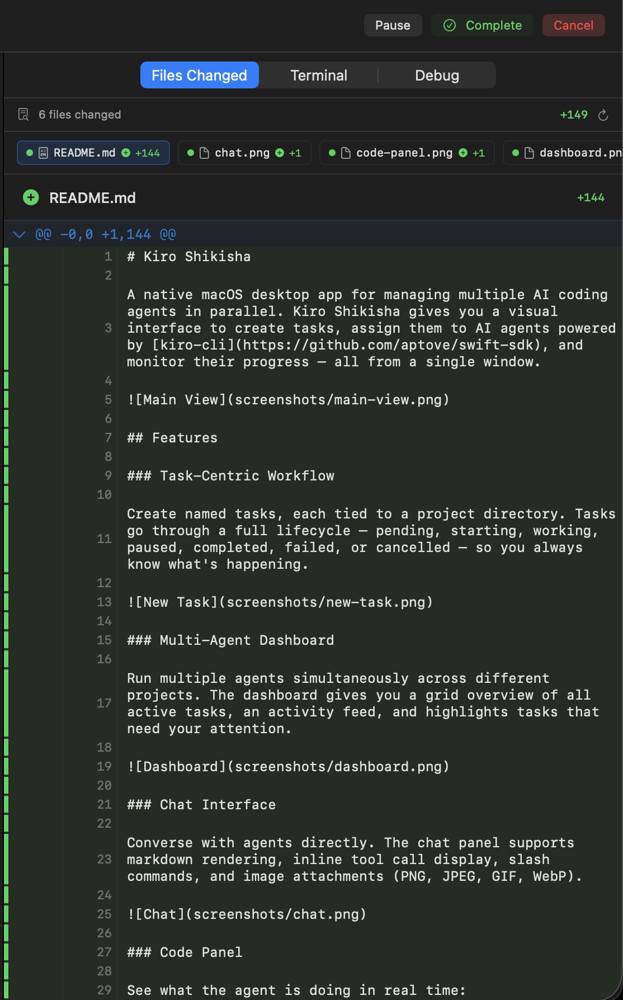

<p align="center">
  
</p>

# Kiro Shikisha

A native macOS desktop app for managing multiple AI coding agents in parallel. Kiro Shikisha gives you a visual interface to create tasks, assign them to AI agents powered by [kiro-cli](https://github.com/aptove/swift-sdk), and monitor their progress — all from a single window.



## Features

### Task-Centric Workflow

Create named tasks, each tied to a project directory. Tasks go through a full lifecycle — pending, starting, working, paused, completed, failed, or cancelled — so you always know what's happening.



### Multi-Agent Dashboard

Run multiple agents simultaneously across different projects. The dashboard gives you a grid overview of all active tasks, an activity feed, and highlights tasks that need your attention.



### Chat Interface

Converse with agents directly. The chat panel supports markdown rendering, inline tool call display, slash commands, and image attachments (PNG, JPEG, GIF, WebP).



### Code Panel

See what the agent is doing in real time:

- **Files Changed** — git diff view with syntax-highlighted, word-level diffs
- **Terminal** — output from commands the agent executes
- **Debug** — raw ACP protocol log for troubleshooting



### Git Worktree Support

When creating a task, Kiro Shikisha detects git repositories automatically. You can optionally create a new git worktree so the agent works on an isolated branch without touching your main working tree.

### Agent Configuration Profiles

Define multiple agent profiles in Settings → Agents. Each profile has a name, an agent identifier, and optional tags. Set a default profile or pick one per task at creation time.

### Session Persistence

Tasks and their ACP sessions are saved automatically. When you relaunch the app, paused tasks reconnect to their previous sessions.

### macOS Native

Built with SwiftUI. Supports light/dark/system themes, configurable font sizes, adjustable split views, keyboard shortcuts, and macOS notifications for agent events.

## Requirements

- macOS 14 (Sonoma) or later
- [kiro-cli](https://github.com/aptove/swift-sdk) installed and authenticated (`kiro-cli login`)
- Swift 6.0+ toolchain (for building from source)

## Installation

### Build from Source

```bash
git clone https://github.com/ryancormack/kiro-shikisha.git
cd kiro-shikisha
swift build
```

The built binary will be at `.build/debug/KiroShikisha`. You can run it directly:

```bash
.build/debug/KiroShikisha
```

For a release build:

```bash
swift build -c release
```

The optimised binary will be at `.build/release/KiroShikisha`.

### kiro-cli Setup

Kiro Shikisha expects `kiro-cli` at `~/.local/bin/kiro-cli` by default. You can change this in Settings → General.

Make sure you're authenticated before launching:

```bash
kiro-cli login
```

## Getting Started

1. Launch the app. The onboarding flow will guide you through verifying your `kiro-cli` path.
2. Create a new task with **⌘⇧T** or the **+** button.
3. Give it a name, choose a project directory, and optionally configure a git branch or worktree.
4. The agent connects and you can start chatting.

## Keyboard Shortcuts

| Shortcut | Action |
|---|---|
| ⌘⇧T | New Task |
| ⌘D | Toggle Dashboard |
| ⌘1–9 | Switch between tasks |
| ⌘Return | Send prompt |
| ⌘. | Cancel current agent action |
| ⌘⇧K | Clear chat history |
| ⌘, | Settings |

## Project Structure

```
Sources/KiroShikisha/
├── App/                  # App entry point and lifecycle
├── Models/               # Data models (Agent, AgentTask, Workspace, etc.)
├── Services/             # Core services
│   ├── AgentManager      # Manages agent lifecycle and ACP communication
│   ├── TaskManager        # Task creation, state transitions, persistence
│   ├── ACPConnection      # ACP protocol transport over subprocess pipes
│   ├── GitService         # Git repo detection, worktree operations
│   ├── SessionStorage     # Session persistence
│   └── NotificationManager # macOS notifications
└── Views/
    ├── Agent/            # Chat panel, message rendering, input
    ├── Code/             # Diff viewer, terminal output, debug log
    ├── Dashboard/        # Multi-task overview grid
    ├── Task/             # Task detail view, new task sheet
    ├── Sidebar/          # Navigation sidebar
    ├── Session/          # Session history
    ├── Settings/         # General, Agents, Appearance settings
    ├── Workspace/        # Workspace management
    ├── Components/       # Shared UI components
    └── Onboarding/       # First-launch setup
```

## Contributing

Contributions are welcome. Please open an issue first to discuss what you'd like to change.

## License

This project is licensed under the [MIT License](LICENSE).
